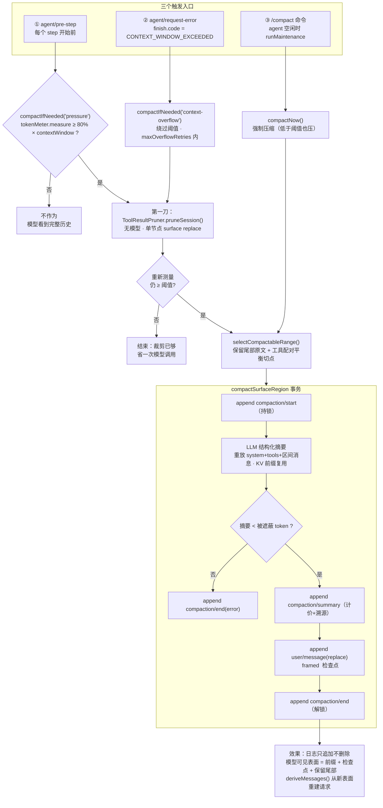
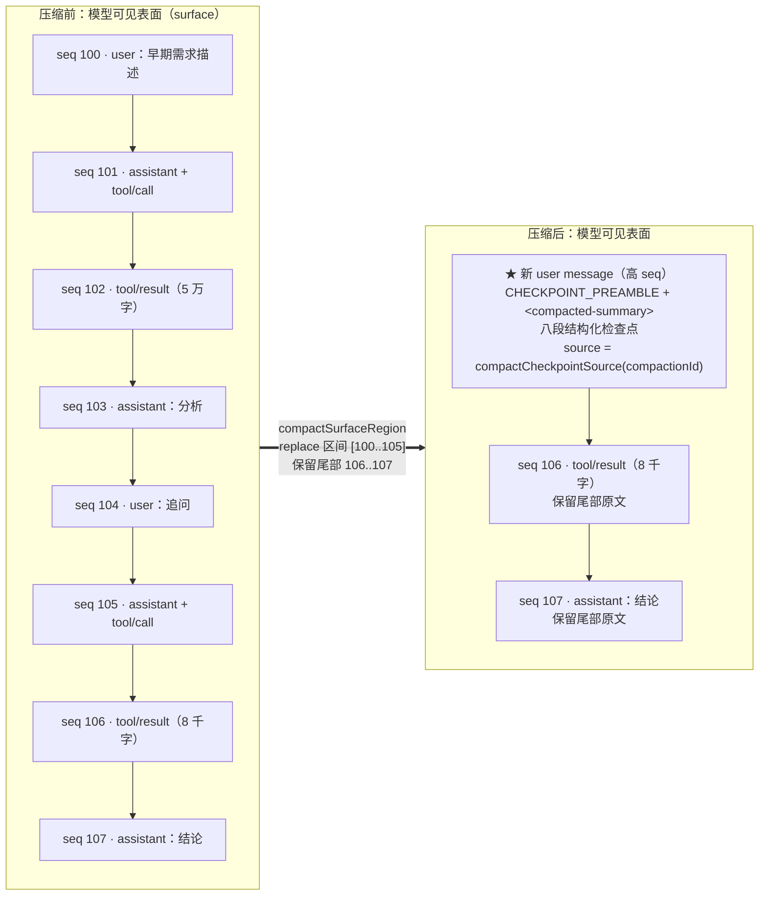
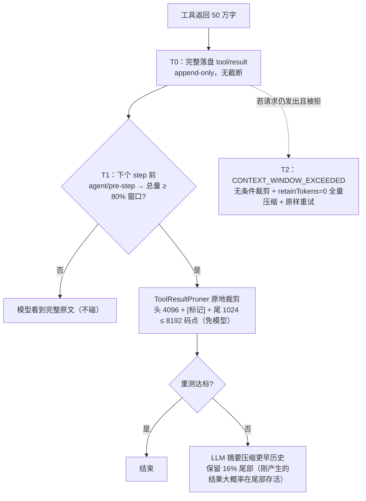
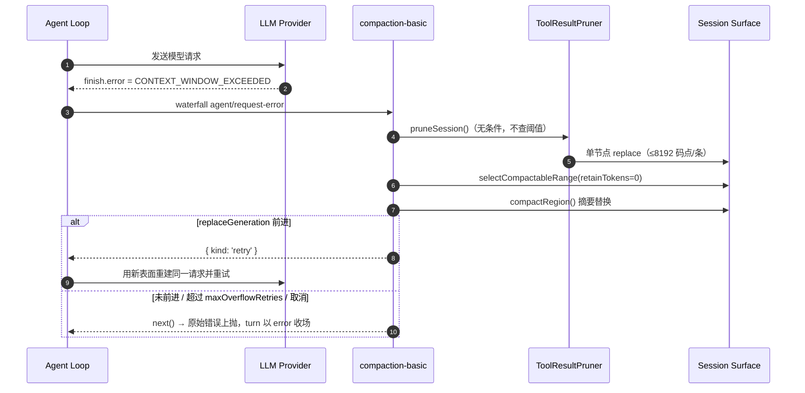

# DeepSeek Harness 上下文压缩机制说明

> 本文基于对 deepseek-harness 仓库源码的完整阅读整理，覆盖：压缩触发时机与流程、压缩方法与事务步骤、压缩前后上下文对比、工具输出超长的裁剪机制、上下文溢出时的"压缩 + 重试"恢复流程。所有结论均标注源码位置（包路径 + 函数名）。

---

## 目录

- [1. 总体架构：一个三角色的 Capability Seam](#1-总体架构一个三角色的-capability-seam)
- [2. 触发时机](#2-触发时机)
- [3. 触发流程](#3-触发流程)
- [4. 压缩方法](#4-压缩方法)
- [5. 压缩事务的具体操作](#5-压缩事务的具体操作)
- [6. 触发与执行总流程图](#6-触发与执行总流程图)
- [7. 上下文压缩前后对比图](#7-上下文压缩前后对比图)
- [8. 工具输出超长的处理：裁剪机制详解](#8-工具输出超长的处理裁剪机制详解)
- [9. 上下文溢出时的"压缩 + 重试"恢复流程](#9-上下文溢出时的压缩--重试恢复流程)
- [10. 手动压缩 /compact](#10-手动压缩-compact)
- [11. 配置默认值速查](#11-配置默认值速查)
- [12. 关键代码索引](#12-关键代码索引)
- [13. 总结](#13-总结)

---

## 1. 总体架构：一个三角色的 Capability Seam

压缩不是 agent-loop 主干的一部分，而是一个可插拔的能力 seam（见 `docs/subsystems/compaction.md`）：

| 角色 | 包 | 挂载点 |
|---|---|---|
| Service Definition | `packages/compaction/compaction` | 抽象类 `CompactionEngine` → `ctx.compaction` |
| Service Provider | `packages/compaction/compaction-basic` | `BasicCompactionEngine`（唯一随附实现） |
| Human Consumer | `packages/compaction/command-compact` | `/compact` 命令 |
| 依赖服务 | `packages/llm/token-meter` | `ctx.tokenMeter`：token 压力测量 |
| 依赖服务 | `packages/compaction/compaction-tool-result-pruner` | `ctx.toolResultPruner`：无模型工具结果裁剪 |

核心接口（`packages/compaction/compaction/src/index.ts`）：

```ts
export abstract class CompactionEngine extends Service {
  // 自动策略：pressure（压力）或 context-overflow（溢出恢复）
  abstract compactIfNeeded(agent, trigger: 'pressure' | 'context-overflow', signal): Promise<CompactionResult | null>
  // 手动：空闲会话强制压缩
  abstract compactNow(agent, signal, sourceCommandId?): Promise<CompactionResult | null>
  // 显式区间压缩
  abstract compactRegion(start, end, agent, signal?): Promise<CompactionResult>
}
```

---

## 2. 触发时机

共三类触发，**全部基于 token 压力，与消息条数无关**：

### ① 自动压力触发（token 阈值）

每个 step 开始前（`agent/pre-step` waterfall）测量最近一次持久化路由请求的 token 总量，超过模型上下文窗口的比例阈值即触发。默认阈值 **80%**：

```ts
// packages/compaction/compaction-basic/src/config.ts:20-23
const DEFAULT_THRESHOLD_RATIO = 0.8
const DEFAULT_RETAIN_RATIO  = 0.16

// config.ts:144 (resolveCompactSpec)
const thresholdTokens = Math.floor(contextWindow * policy.thresholdRatio)
const retainTokens = policy.retainTokens === undefined
  ? Math.floor(contextWindow * policy.retainRatio)   // 保留尾部预算，默认 16%
  : policy.retainTokens
```

### ② 上下文溢出触发（provider 确认）

模型请求以 `CONTEXT_WINDOW_EXCEEDED_CODE = 'CONTEXT_WINDOW_EXCEEDED'` 失败时（`packages/llm/llm/src/error.ts:25`，由 DeepSeek / pi-ai 适配器映射），走溢出恢复路径——**绕过正常阈值**强制做一次有效缩减，重试次数受 `maxOverflowRetries`（默认 1）限制。

### ③ 手动触发

用户执行 `/compact` 命令（`command-compact/src/index.ts:66` 调用 `ctx.compaction.compactNow()`），仅在 agent 空闲时执行（经 `agent.runMaintenance()`），**即使低于压力阈值也强制压缩**。

---

## 3. 触发流程

检测由 **agent-loop 发事件 → compaction-basic 监听决策**，两层解耦。

### 事件发射端（agent-loop）

```ts
// packages/core/agent-loop/src/agent.ts:234 (preStep) — 每个 step 前
const decision = await this.dispatch.waterfall(
  'agent/pre-step', { messages: claimed, ...position, signal }, ...)

// packages/core/agent-loop/src/agent.ts:374 (step) — 请求 finish 为 error 时
const action = await this.dispatch.waterfall(
  'agent/request-error', { turn, step, provider, failure: finish.failure, ... }, ...)
```

### 监听与决策端（compaction-basic）

`BasicCompactionEngine` 构造时（`auto: true` 默认开）注册自动监听（`compaction-basic/src/index.ts:137-224`，`_registerAutomaticCompaction()`）：

```ts
// index.ts:147-165 — 压力触发
ctx.on('agent/pre-step', async ({ agent, signal }, next) => {
  const result = await this.compactIfNeeded(agent, 'pressure', signal)
  ...
  return next()   // waterfall 必须委托
})

// index.ts:179-223 — 溢出恢复
ctx.on('agent/request-error', async ({ agent, failure, signal }, next) => {
  if (failure.code !== CONTEXT_WINDOW_EXCEEDED_CODE || signal.aborted) return next()
  ...
  result = await this.compactIfNeeded(agent, 'context-overflow', signal)
  if (agent.session.surface.replaceGeneration > generation)
    return { kind: 'retry' }   // 表面前进了才重试原请求
  return next()
})
```

### 关键函数链

| 函数 | 位置 | 职责 |
|---|---|---|
| `compactIfNeeded(agent, trigger, signal)` | `compaction-basic/src/index.ts:258` | 策略决策入口：测压 → 判阈值 → 剪枝 → 选范围 → 压缩，可多轮重试（`compactionRetries` 默认 1） |
| `routedTarget(session)` | `index.ts:52` | 从 `session.requestHeader()` 读最近路由的 provider/model |
| `resolveCompactSpec(policy, contextWindow)` | `config.ts:133` | 按模型容量算出 `thresholdTokens` / `retainTokens` |
| `meter.measure(session)` | `token-meter/src/index.ts:116` | 优先复用 provider 上报的 usage，否则启发式估算 |
| `selectCompactableRange(session, measurement, retainTokens)` | `region.ts:98` | 选出待压缩区间 |
| `compactSurfaceRegion(...)` | `region.ts:152` | 核心压缩事务 |
| `summarizeWithLlm(...)` | `summarizer.ts:121` | 一次性 LLM 摘要调用 |
| `compactNow()` / `compactRegion()` | `index.ts:368 / 343` | 手动 / 显式范围入口 |

**范围选择逻辑**（`selectCompactableRange`，`region.ts:98-134`）：从尾部向前累积节点 token 直到达到 `retainTokens`，保留近期尾部原文；再向左回退到第一个"工具配对平衡"的切点（不能把 assistant 的 tool-call 和它的 tool-result 拆开，用 `toolPairingBalancedBefore/After`，`compaction/src/tool-pairing.ts:117-131`）。溢出路径传 `retainTokens = 0`，即几乎全量压缩、只留尾部一个节点。

---

## 4. 压缩方法

**不是截断或删除，而是"摘要替换 + 可选无模型裁剪"**，且历史永不物理删除。

### 第一层：工具结果裁剪（无模型调用，可选）

`ToolResultPruner.pruneSession()`（`compaction-tool-result-pruner/src/index.ts:136`）把超预算（按 Unicode 码点计）的 `tool/result` 文本改成 **头部 + `[... tool result middle pruned ...]` 标记 + 尾部**，通过单节点 surface replace 落盘。裁剪后重新测量，若已低于阈值则跳过摘要（省一次模型调用）。

```ts
// compaction-tool-result-pruner/src/config.ts:7,10-14
export const PRUNE_MARKER = '\n\n[... tool result middle pruned ...]\n\n'
export const DEFAULTS = deepFreeze({
  thresholdChars: 8192,   // 单条结果的裁剪资格线 / 裁后上限
  headChars: 4096,        // 保留头部
  tailChars: 1024,        // 保留尾部
})
```

### 第二层：LLM 结构化摘要

`summarizeWithLlm()`（`summarizer.ts:121`）发起一次性 `ctx.llm.stream()` 调用（`purpose: 'compaction'`，DeepSeek 适配器会加 `x-deepseek-harness-compact: 1` 归因头）。关键设计是 **KV-cache 前缀复用**——请求重放对话自身的 system prompt + tools + 被压缩区间的原始消息，压缩指令只作为最后一条 user message 追加：

```ts
// summarizer.ts:24-30（JSDoc 摘录）
// The summarization directive, delivered as the FINAL user message after the
// replayed conversation rather than as a distinct summarizer system prompt.
// ... makes the auxiliary call a genuine prefix of the last routed
// request, so the provider's KV cache is reused instead of invalidated.
```

摘要输出是固定结构的 Markdown 检查点（`COMPACTION_INSTRUCTION`，summarizer.ts:31-66）：
`Primary Request and Intent` / `Key Technical Concepts` / `Files and Code` / `Errors and Fixes` / `Pending Jobs` / `Current Work` / `Next Step` / `Critical Context`——要求保留精确路径、命令、错误串、数值；若对话中已有旧 `<compacted-summary>` 块则合并而非照抄。

### 无外部存储

摘要与被压缩内容**都留在同一个持久 session log 里**——被压缩节点只是从"surface"（模型可见投影）上被遮蔽，日志原样保留，可回放、可审计。

---

## 5. 压缩事务的具体操作

`compactSurfaceRegion()`（`region.ts:152-254`）是一个带持久锁的事务：

| 步骤 | 操作 | 位置 |
|---|---|---|
| ① | `validateSurfaceRegion()` 校验区间存在、有序、两端工具配对平衡 | region.ts:315 |
| ② | `assertCompactionInactive()` 检查无未闭合的 `compaction/start`（持久锁） | region.ts:286 |
| ③ | `session.append('compaction/start')` 写入开标记 = 持久锁（自动路径挂当前 turn，手动为 `turn: null`） | region.ts:189 |
| ④ | `prepareCompaction()` 快照计价 + `buildSummarizationInput()` | region.ts:339/498 |
| ⑤ | `summarizeCompaction()` 调 LLM 摘要；用 `compactCheckpointSource()` 构造检查点消息；若摘要 token ≥ 被遮蔽 token 则拒绝 | region.ts:360-384 |
| ⑥ | 稳定性检查：自动路径 `assertWholeSurfaceUnchanged`（整个 surface 不变）；手动路径 `assertSelectedSpanStable`（只要求选中区间稳定，摘要期间新消息仍可进入） | region.ts:387-424 |
| ⑦ | `commitCompactionBody()` 同步提交（期间不让出） | region.ts:427 |
| ⑧ | `session.append('compaction/end')` 闭锁；失败时也写 end 并带 error 字段 | region.ts:215/223 |
| ⑨ | 手动路径额外 flush 持久化 | region.ts:231-237 |

### 对消息历史的处理（第⑦步核心）

```ts
// region.ts:447-465 (commitCompactionBody)
const summaryEvent = session.append('compaction/summary', {
  compactionId, summary, rawOutput?, llmStreamCall: true,
  shadowedRange: { start, end }, shadowedSeqs, shadowedTokenCount,
  provider, model, maxTokens?, usage?,        // 摘要调用的完整溯源
})
session.append('user/message', checkpointMessage, {
  surfaceOp: { op: 'replace', start, end },   // ← 表面替换操作
  sourceEventSeqs: [startEvent.seq, summaryEvent.seq, ...shadowedSeqs],
})
```

- 共写入 **4 个日志事件**：`compaction/start` → `compaction/summary`（仅日志、不进表面）→ 带 `surfaceOp: replace` 的 `user/message`（摘要检查点）→ `compaction/end`。
- 替换消息用 `frameSummary()` 包装：`CHECKPOINT_PREAMBLE`（"这是自动生成的检查点……直接继续任务"）+ `<compacted-summary>` 标签包裹的摘要正文（summarizer.ts:189-195）。
- 检查点消息的 `source` 携带 `compactCheckpointSource(compactionId)`（`compaction/src/checkpoint.ts:33`），任何消费方可独立于后端识别/关联它。
- **追加即可回放**约束：session 层 `assertProvenance`（`session/src/surface.ts:240`）强制 `sourceEventSeqs` 必须覆盖每个被遮蔽节点，满足 "Model-visible ⟺ logged" 不变量；`tool/result` 替换还被 `assertToolResultRewrite`（surface.ts:287）限制为只许改 content。

### 对系统提示的处理

**系统提示不参与压缩、也不受影响**。它不存在 session 表面上，而是每次请求由 system-prompt 服务动态组装（agent-loop `preStep()` 里的 `this.loopCtx.systemPrompt.assemble(...)`）。压缩只做两件与它相关的事：`buildSummarizationInput()`（region.ts:498-514）从 `session.requestHeader()` 原样取 `system` 和 `tools` 给摘要调用做前缀对齐；下一次真实请求的 system prompt 由正常组装流程重新生成，与压缩无关。

### 压缩后的请求重建

`Session.deriveMessages()`（`session/src/index.ts:726`）沿 surface 节点折叠出消息历史；`replace` 操作把被遮蔽节点从推导中删除（`replaceGeneration` 递增触发缓存重建）。下一次模型请求看到：

```
[区间之前的消息] + [摘要检查点 user message] + [区间之后的保留尾部消息]
```

---

## 6. 触发与执行总流程图



---

## 7. 上下文压缩前后对比图



**对比要点：**

| 维度 | 压缩前 | 压缩后 |
|---|---|---|
| 模型可见消息 | 完整历史（区间 100–105 共 6 条） | 1 条摘要检查点 + 保留尾部（106–107） |
| session 日志 | 全部事件 | **全部事件仍在**（append-only），旧节点仅被"表面遮蔽" |
| token 量 | 区间 100–105 全量计价 | 检查点 framed token（契约上必须 < 被遮蔽 token） |
| tool-call/result 配对 | — | 区间边界由 `toolPairingBalancedBefore/After` 保证不拆对 |
| 下一次请求 | — | `deriveMessages()` 沿新表面折叠，`replaceGeneration` 递增触发缓存重建 |
| system prompt | 每次动态组装 | 不受影响；仅摘要调用复用它做 KV 前缀对齐 |

---

## 8. 工具输出超长的处理：裁剪机制详解

### 8.1 前提：工具结果先完整落盘，入日志时没有任何全局截断

```ts
// packages/core/agent-loop/src/tool-calls.ts:268 (appendToolResult)
session.append('tool/result', {
  turn, step, message,           // message.content 就是工具的完整输出
}, { surfaceOp: 'append', sourceEventSeqs: [callSeq] })
```

agent-loop 层不做裁剪——超长结果**原样**写入持久日志。只有个别工具自己控制输出（read 的每行上限、search 的分页 `truncated: true`），bash 这类无界输出完全靠裁剪 + 压缩兜底。

### 8.2 8192 不是"载入上限"，而是"裁剪资格线 + 裁后上限"

裁不裁由**整个会话的压力**决定，不是单条结果的大小。调用顺序（`compaction-basic/src/index.ts:303-312`）：

```ts
const spec = resolveCompactSpec(policy, context.contextWindow)
if (measurement.totalTokens < spec.thresholdTokens) return null   // ① 先看全会话总量
...
if (prune !== undefined) {
  prune.pruneSession(agent.session)                               // ② 总量超标才裁
  measurement = meter.measure(agent.session)
}
if (measurement.totalTokens < spec.thresholdTokens) return null   // 裁完就够 → 不调 LLM
```

- **压力没到**（会话总量 < 80% × 窗口）：工具结果多长都**原样完整进上下文**。
- **压力到了**：表面上**每一条**文本超过 8192 码点的 `tool/result` 各自被重写为 ≤ 8192（实际 ≈ 头 4096 + 标记 + 尾 1024 ≈ 5158 码点）。

用具体数字对比（128K 窗口，阈值 ≈ 102K token）：

| 场景 | 会话总量 | 那条 2 万字的工具结果 |
|---|---|---|
| 会话刚开始，总量 3 万 token | < 102K | **完整载入**，模型看全文 |
| 会话已积累，总量 11 万 token | ≥ 102K | 被裁成"头 4096 + [标记] + 尾 1024"，约 5 千字 |

量纲说明：**80% 阈值的单位是 token**（按模型窗口算），**8192 的单位是 Unicode 码点（字符）**。8192 字的结果本身可能只占 ~4K token，单独撑不爆窗口——裁它是因为"会话快满了，它是表面上最肥的可削减项"。

### 8.3 裁剪的实现约束

- **无模型调用**，同步落盘：先写 `compaction/prune` 影子计价事件，紧跟单节点 `surfaceOp: replace` 的新 `tool/result`（pruner index.ts:162-173）。
- session 层 `assertToolResultRewrite`（`session/src/surface.ts:287`）强制替换**只能改 content**，callId 等原样保留——tool-call/result 配对和 provider 校验不受影响。
- **原始全文不丢**：日志 append-only，被裁剪只是表面遮蔽，重放/UI 可还原全文。
- 配置校验钉死输出预算：`headChars + marker + tailChars ≤ thresholdChars` 在插件加载时强制（pruner config.ts:55-63），单条裁后结果永远不可能成为"不可修复单元"。

### 8.4 工具输出超长处理时间线



---

## 9. 上下文溢出时的"压缩 + 重试"恢复流程

### 9.1 流程时序图



### 9.2 关键语义

- **无条件先裁**：溢出路径不查阈值，先 `pruneSession()`，再 `selectCompactableRange(session, measurement, 0)`（`retainTokens = 0`，几乎全量压缩、只留最后一个节点，工具配对平衡约束下微调）——`compaction-basic/src/index.ts:283-291`。
- **只有表面真前进了才重试**：`agent.session.surface.replaceGeneration > generation` 才返回 `{ kind: 'retry' }`，循环用**新表面重建请求并重试同一个 step**（index.ts:218-222）。
- **重试预算**：`maxOverflowRetries`（默认 1）；agent 转入 idle（`agent/status` 监听）或下一次请求成功（`assistant/message` 事件）时计数器清零（index.ts:167-177）。
- **部分成果保留**：即使裁剪成功后摘要阶段失败，已落盘的裁剪成果也算数，照样重试（index.ts:195-208 注释明确保护这一点）；取消信号始终优先。
- **救不回来就报错**：`CompactionEngine` 契约写明（`compaction/src/index.ts:105-106`）——*"A single oversized retained unit or request envelope cannot be repaired through surface compaction"*。单条保留单元或请求信封本身超窗时表面压缩无能为力，原始 `CONTEXT_WINDOW_EXCEEDED` 错误向上传播，turn 以 `turnEnds = { kind: 'error' }` 收场（`agent.ts:309`）。对工具输出而言这个兜底很难触发（裁后 ≤ 8192 码点）；真正会触底的是巨型 system prompt / 请求信封这类压缩管不到的东西。

---

## 10. 手动压缩 /compact

`command-compact`（`packages/compaction/command-compact/src/index.ts`）注册 `/compact` 命令：

- 调用 `ctx.compaction.compactNow(agent, signal, commandId)`，经 `agent.runMaintenance()` **仅在 agent 空闲时执行**，期间扣留后续唤醒输入。
- **低于压力阈值也强制压缩**（"compact useful history even below automatic pressure thresholds"）。
- 写**独立的 `turn: null` 标记对**（不挂任何 open turn），闭锁后先 `flush` 持久化再放行排队提示。
- 摘要期间**新消息仍可进入**（稳定性检查只要求选中区间不变，`assertSelectedSpanStable`）。
- 失败分类为 `ManualCompactionError`：`busy` / `cancelled` / `changed` / `summary` / `commit` / `persistence`，命令层转成人类可读结果（index.ts:23-55）。

---

## 11. 配置默认值速查

### compaction-basic（`BasicCompactionConfig`）

| 配置 | 默认值 | 含义 |
|---|---|---|
| `thresholdRatio` | `0.8` | 压力阈值 = contextWindow × 0.8 |
| `retainRatio` | `0.16` | 保留尾部 = contextWindow × 0.16 |
| `retainTokens` | （与 retainRatio 互斥） | 绝对保留尾部预算 |
| `maxTokens` | `8192` | 摘要调用的生成上限 |
| `compactionRetries` | `1` | 压力路径压缩后仍超阈值的重试次数 |
| `maxOverflowRetries` | `1` | 溢出恢复的重试次数 |
| `auto` | `true` | 是否注册自动触发监听 |
| `summarizationProvider/Model` | 空 | 摘要专用路由；空则沿用会话路由 |
| `modelPolicies` | `[]` | 按精确 provider/model 对的部分覆盖 |

### compaction-tool-result-pruner（`ToolResultPruneConfig`）

| 配置 | 默认值 | 含义 |
|---|---|---|
| `thresholdChars` | `8192` | 单条结果的裁剪资格线 / 裁后上限 |
| `headChars` | `4096` | 裁后保留头部码点数 |
| `tailChars` | `1024` | 裁后保留尾部码点数 |

所有值均可在 cordis.yml 中调整；未知键、重复目标、互斥保留形式、`retainRatio ≥ thresholdRatio` 等在插件加载时直接失败（fail loud）。

---

## 12. 关键代码索引

| 主题 | 文件 | 关键符号 |
|---|---|---|
| Service Definition | `packages/compaction/compaction/src/index.ts` | `CompactionEngine`, `CompactionTrigger`, `ManualCompactionError` |
| 压缩事件词汇 | `packages/compaction/compaction/src/types.ts` | `compaction/start` / `summary` / `end` / `prune`, `CompactionResult` |
| 检查点溯源 | `packages/compaction/compaction/src/checkpoint.ts` | `compactCheckpointSource`, `isCompactCheckpointSource` |
| 工具配对平衡 | `packages/compaction/compaction/src/tool-pairing.ts` | `toolPairingBalancedBefore/After` |
| 后端实现 | `packages/compaction/compaction-basic/src/index.ts` | `BasicCompactionEngine`, `_registerAutomaticCompaction`, `compactIfNeeded`, `compactNow` |
| 阈值与保留策略 | `packages/compaction/compaction-basic/src/config.ts` | `resolveConfig`, `resolveCompactSpec`, `DEFAULT_THRESHOLD_RATIO` |
| 压缩事务 | `packages/compaction/compaction-basic/src/region.ts` | `compactSurfaceRegion`, `selectCompactableRange`, `commitCompactionBody` |
| LLM 摘要 | `packages/compaction/compaction-basic/src/summarizer.ts` | `summarizeWithLlm`, `COMPACTION_INSTRUCTION`, `frameSummary` |
| 工具结果裁剪 | `packages/compaction/compaction-tool-result-pruner/src/index.ts` | `ToolResultPruner.pruneSession`, `pruneContent` |
| 裁剪默认值 | `packages/compaction/compaction-tool-result-pruner/src/config.ts` | `PRUNE_MARKER`, `DEFAULTS` |
| 事件发射 | `packages/core/agent-loop/src/agent.ts` | `preStep`(:234), `step` 请求错误(:374) |
| 工具结果落盘 | `packages/core/agent-loop/src/tool-calls.ts` | `appendToolResult`(:268) |
| 表面替换机制 | `packages/core/session/src/surface.ts` | `planSurfaceEvent`, `assertProvenance`, `assertToolResultRewrite`, `replaceGeneration` |
| 请求重建 | `packages/core/session/src/index.ts` | `Session.deriveMessages()`(:726) |
| token 测量 | `packages/llm/token-meter/src/index.ts` | `TokenMeter.measure()`(:116) |
| 溢出错误码 | `packages/llm/llm/src/error.ts` | `CONTEXT_WINDOW_EXCEEDED_CODE`(:25) |
| 手动命令 | `packages/compaction/command-compact/src/index.ts` | `executeCompact`, `expectedFailure` |

---

## 13. 总结

```
                 ┌── agent/pre-step（每 step 前）──► compactIfNeeded('pressure')
三个触发入口 ────┤                                   条件: tokenMeter ≥ 80% × contextWindow
                 ├── agent/request-error（溢出）───► compactIfNeeded('context-overflow')
                 │                                   code=CONTEXT_WINDOW_EXCEEDED，绕过阈值，maxOverflowRetries 次内
                 └── /compact（空闲维护）─────────► compactNow() 强制压缩

    ┌─ 第一层：ToolResultPruner.pruneSession()  无模型，超长 tool/result → 头+[标记]+尾（单节点 replace）
    │         └─ 重新测量，低于阈值则到此为止
    ├─ 第二层：selectCompactableRange()  保留 16% 尾部原文 + 工具配对平衡切点
    ▼
compactSurfaceRegion 事务:
  compaction/start(锁) → LLM 结构化摘要(重放 system+tools+区间消息, KV 前缀复用)
  → 摘要必须更小 → compaction/summary(计价+溯源) → user/message(replace, <compacted-summary> 检查点)
  → compaction/end(解锁) →(手动)flush

效果: 日志只追加不删除; 模型可见表面 = 前缀 + 摘要检查点 + 保留尾部;
     下次请求由 deriveMessages() 从新表面重建, system prompt 与压缩完全解耦。
```

**一句话概括**：DSH 的压缩是"基于 token 压力阈值（默认 80% 上下文窗口）或 provider 溢出确认的事件驱动摘要替换"——agent-loop 发 `agent/pre-step` / `agent/request-error` waterfall，`compaction-basic` 监听决策，先做无模型的工具结果裁剪，再把选定的表面区间（保留 16% 尾部、工具配对平衡）通过一个 `compaction/start → summary → user/message(replace) → end` 的持久锁事务替换为一条带 `<compacted-summary>` 标签的结构化检查点 user message，日志完整保留被遮蔽原文以满足"模型可见 ⟺ 可从日志重建"不变量。

工具输出超长的处理一句话：**大结果先原样进日志，模型看到什么取决于压力——不超阈值就看全文；超了先被无模型地裁成"头 4K + 标记 + 尾 1K"（8192 是裁剪资格线与裁后上限，不是载入硬上限），还不够就把更老的历史摘要掉；真到 provider 报溢出还有一次"裁剪 + 全量压缩 + 原样重试"的恢复机会。**
